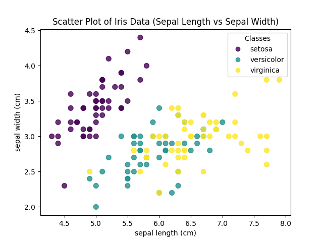
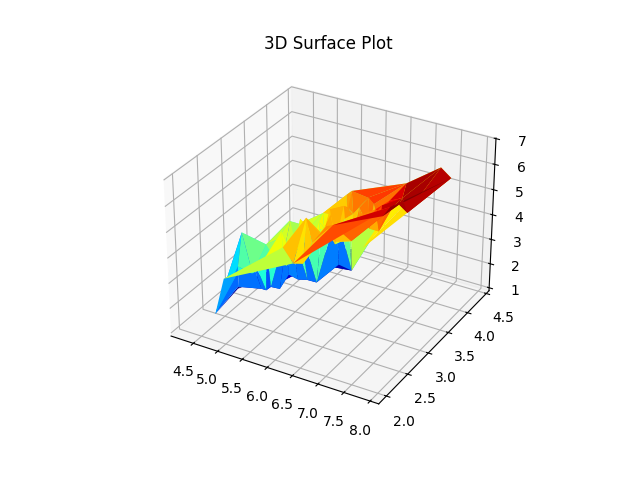
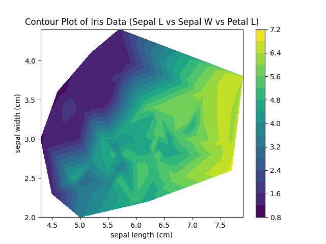
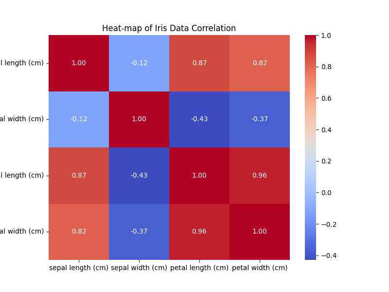
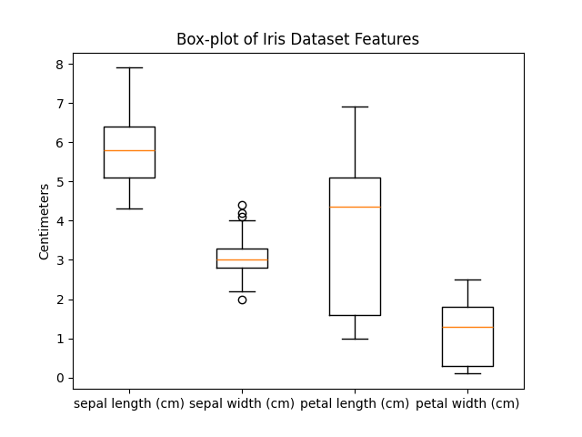
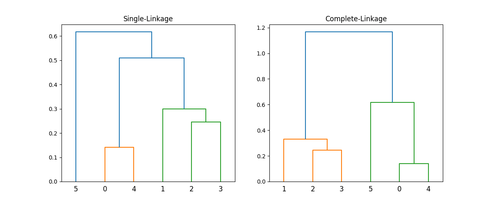
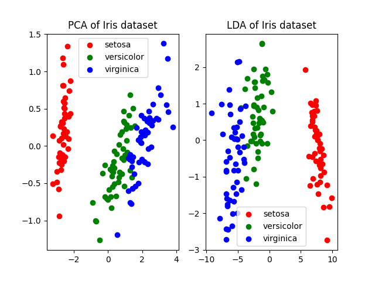

# Machine Learning Lab Explanations

## `1a.py`

### Output
*No output printed to console.*

### Graph


## `1b.py`

### Output
```text
Starting state: 1.5107
Local maximum found at x = 2.0107
Objective value: 3.9999
```

## `2a.py`

### Output
*No output printed to console.*

### Graph


## `2b.py`

### Output
```text
Goal Reached!
Path traversed: ['S', 'A', 'D', 'G']
```

## `3a.py`

### Output
*No output printed to console.*

### Graph


## `3b.py`

### Output
```text
A* Path: ['S', 'A', 'C', 'G']
Total Cost: 6
```

## `4a.py`

### Output
*No output printed to console.*

### Graph


## `4b.py`

### Output
```text
Optimal value: 3
Optimal path: [0, 1, 3]
```

## `5a.py`

### Output
*No output printed to console.*

### Graph


## `5b.py`

### Output
```text
The optimal value is: 5
The optimal path taken is: [0, 1, 3, 5]
```

## `6.py`

### Output
```text
Accuracy: 0.7988826815642458
Confusion Matrix:
 [[91 19]
 [17 52]]
```

## `7.py`

### Output
```text
Accuracy with Euclidean distance (k=3): 0.6462
Accuracy with Manhattan distance (k=3): 0.6462
```

## `8.py`

### Output
*No output printed to console.*

### Graph


## `8o.py`

### Output
*No output printed to console.*

### Graph


## `9.py`

### Output
```text
Proximity Matrix:
 [[0.   0.54 0.51 0.65 0.14 0.62]
 [0.54 0.   0.3  0.33 0.61 1.09]
 [0.51 0.3  0.   0.24 0.51 1.09]
 [0.65 0.33 0.24 0.   0.65 1.17]
 [0.14 0.61 0.51 0.65 0.   0.62]
 [0.62 1.09 1.09 1.17 0.62 0.  ]]
```

### Graph


## `10.py`

### Output
*No output printed to console.*

### Graph


## `11.py`

### Output
```text
AND Gate
Input: [0 0] -> Output: 0
Input: [0 1] -> Output: 0
Input: [1 0] -> Output: 0
Input: [1 1] -> Output: 1

OR Gate
Input: [0 0] -> Output: 0
Input: [0 1] -> Output: 1
Input: [1 0] -> Output: 1
Input: [1 1] -> Output: 1
```

## `add_code_breakdowns.py`

### Output
```text
Code breakdowns added to markdown files successfully.
```

## `update_mds.py`

### Output
```text
Markdown files updated.
```

