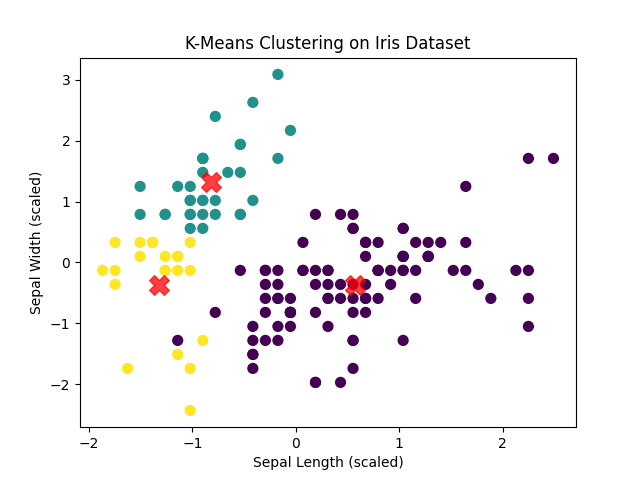
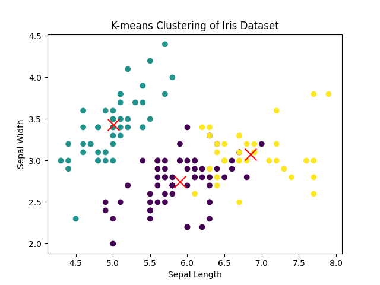

# Program 8: K-Means Clustering on Iris Dataset

### 1. Conceptual Overview
**K-Means** is an **unsupervised** machine learning algorithm. 
*   **Unsupervised:** This means the algorithm is NOT given the answers (labels). We do not tell it which flower is *Setosa* or *Virginica*. We just dump a massive spreadsheet of measurements into the computer and say, *"Find the hidden patterns and group them."*

### 2. Step-by-Step Logic
The "K" stands for the number of groups (clusters) you want to create. The "Means" refers to the averaging of data.
1.  **Initialization:** The algorithm places $K$ random center points (called **Centroids**) anywhere on the graph.
2.  **Assignment:** It looks at every single data point and calculates its distance to the $K$ centroids. Each data point is assigned to the cluster of whichever centroid is closest to it.
3.  **Update:** Now that the points are grouped, the algorithm calculates the true mathematical average (the "mean" center) of all the points in a group. The centroid moves to this new true center position.
4.  **Repeat:** Because the centroid moved, some points might now be closer to a different centroid! The algorithm repeats Steps 2 and 3 until the centroids stop moving entirely (Convergence).

### 3. Application to the Iris Dataset
We feed the algorithm the Sepal Length, Sepal Width, Petal Length, and Petal Width of 150 flowers, but we **hide** the species names. We tell the algorithm $K=3$. The algorithm will automatically find that the measurements naturally form 3 distinct mathematical clusters, effectively "discovering" the 3 species of Iris flowers entirely on its own!

### 4. Key Concepts to Mention in Exams
*   **Elbow Method:** How do you know what $K$ should be if you don't know the data? You use the "Elbow Method", plotting the error rate for $K=1, 2, 3, 4, 5$. The graph looks like an arm, and the "elbow" joint is the mathematically optimal number of clusters.
*   **Random Initialization Trap:** Sometimes, the initial random placement of centroids is so bad that the algorithm fails to find the true clusters. Modern implementations use `k-means++` to smartly place the initial centroids far away from each other.

### 5. Real-World Application
*   **Marketing Customer Segmentation:** A supermarket has millions of rows of purchasing data. They run K-Means with $K=4$. The algorithm automatically discovers 4 distinct groups: "Bargain Hunters", "Luxury Buyers", "Bulk Buyers", and "Health Enthusiasts". The marketing team can now send targeted emails to each specific cluster.

## Execution Output & Interpretations

### 8.py & 8o.py: K-Means Clustering
**Graphs:**

**How to understand these graphs:**
* **What they show:** K-Means is an *unsupervised* algorithm. It groups data into `K` distinct clusters based on feature similarity.
* **The Clusters (Colors):** Each color represents a newly formed cluster. The algorithm decided these points belong together.
* **The Centroids (often marked with an 'X' or distinct dot):** These are the exact mathematical center-points of each cluster. 
* **Interpretation:** You are looking to see if the algorithm successfully identified natural groupings in the data. If the clusters are well-separated and make logical sense, K-Means did a good job! The output arrays represent which cluster (0, 1, or 2) each data point was assigned to.

## Deep Dive Code Breakdown

### 8.py & 8o.py: K-Means Variables
*   `KMeans(n_clusters=3, random_state=42)`:
    *   `n_clusters=3`: This is the 'K' in K-Means. You must hardcode how many groups you want the algorithm to divide the data into.
*   `plt.scatter(centroids[:, 0], centroids[:, 1], marker='x', s=200, c='red')`:
    *   `centroids[:, 0]`: The X-coordinates of the calculated center-points of the clusters.
    *   `marker='x'`: Changes the shape of the point from a standard dot to an 'X' so it is easily distinguished from normal data points.
    *   `s=200`: Makes the 'X' massive (size 200) so it's highly visible.
